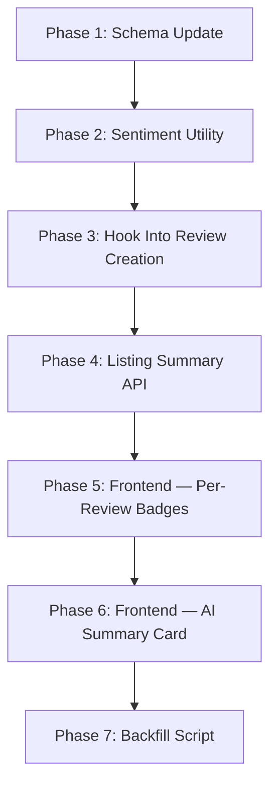

# 🎯 Sentiment Analysis on Reviews — What It Is & How We'll Build It

---

## What Is Sentiment Analysis?

**Sentiment Analysis** is a branch of NLP (Natural Language Processing) that determines whether a piece of text expresses a **positive**, **negative**, or **neutral** emotion.

### Simple Example

| Review Text | Sentiment | Score |
|-------------|-----------|-------|
| *"Amazing place! The view was breathtaking and the host was super friendly."* | 😊 Positive | 5/5 |
| *"It was okay, nothing special. Location was decent."* | 😐 Neutral | 3/5 |
| *"Terrible experience. Dirty rooms, rude staff, would never come back."* | 😠 Negative | 1/5 |

### But wait — don't we already have star ratings?

Yes! But there's a key difference:

| Star Rating (Manual) | Sentiment Analysis (AI) |
|---------------------|------------------------|
| User picks a number (1-5) | AI **reads** the actual text and understands the emotion |
| A user might give 4 stars but write a negative comment | AI catches this mismatch |
| Just one number | AI extracts **specific themes** (location, cleanliness, noise, food) |
| No summary possible | AI can summarize 20 reviews into 1 paragraph |

> **The AI goes deeper than a number** — it understands *what* guests loved and *what* they complained about.

---

## What Will It Look Like in WanderLust?

### Currently (Before):
```
Reviews (5)
┌──────────────────────────────────┐
│ 👤 Rahul    ⭐⭐⭐⭐⭐             │
│ "Amazing place, loved the view!" │
├──────────────────────────────────┤
│ 👤 Priya    ⭐⭐⭐               │
│ "Decent stay, but noisy area"    │
└──────────────────────────────────┘
```

### After (With Sentiment Analysis):

```
┌─────────────────────────────────────────────────────────────┐
│  🧠 AI Review Summary                                       │
│                                                              │
│  Overall: 😊 Mostly Positive (4.2 avg sentiment)            │
│                                                              │
│  ✅ Guests love: Location, Views, Hospitality                │
│  ⚠️ Some mention: Noise, Parking                             │
│                                                              │
│  "Guests consistently praise the stunning views and          │
│   welcoming host. A few noted street noise at night."        │
│                                                              │
│  Sentiment Breakdown:                                        │
│  ██████████████░░  Positive (70%)                            │
│  ████░░░░░░░░░░░░  Neutral  (20%)                            │
│  ██░░░░░░░░░░░░░░  Negative (10%)                            │
└─────────────────────────────────────────────────────────────┘

Reviews (5)
┌──────────────────────────────────────────────────┐
│ 👤 Rahul    ⭐⭐⭐⭐⭐    😊 Positive               │
│ "Amazing place, loved the view!"                  │
│ 🏷️ Location • Views • Hospitality                │
├──────────────────────────────────────────────────┤
│ 👤 Priya    ⭐⭐⭐       😐 Mixed                   │
│ "Decent stay, but noisy area"                     │
│ 🏷️ Stay Quality(+) • Noise(-)                    │
└──────────────────────────────────────────────────┘
```

---

## How We'll Build It — Step by Step

### Overview of All Phases



---

### Phase 1: Update Review Schema

**What**: Add `sentiment` fields to the review model.

**Currently** your review model has:
```javascript
{
    comment: String,        // The review text
    rating: Number,         // Star rating (1-5)
    author: ObjectId        // Who wrote it
}
```

**After**:
```javascript
{
    comment: String,
    rating: Number,
    author: ObjectId,
    
    // ── NEW: AI Sentiment Fields ──
    sentiment: {
        score: Number,          // 1-5 (AI's interpretation of the text tone)
        label: String,          // "positive" | "neutral" | "negative"
        themes: [String]        // ["Location", "Cleanliness", "Value", "Noise"]
    }
}
```

**Why 3 sub-fields?**
- `score` (1-5): Numeric, useful for averaging and charts
- `label` ("positive"/"neutral"/"negative"): Human-readable, useful for badges and filtering
- `themes` (array): What aspects the review mentions — this is the most impressive part for interviews

---

### Phase 2: Create Sentiment Utility

**What**: A new utility `utils/sentiment.js` that calls Gemini to analyze review text.

**How it works**:
```javascript
// utils/sentiment.js
const { GoogleGenerativeAI } = require('@google/generative-ai');
const genAI = new GoogleGenerativeAI(process.env.GEMINI_API_KEY);

async function analyzeSentiment(reviewText) {
    const prompt = `Analyze this travel review. Return ONLY valid JSON:
    {
        "score": <1-5>,
        "label": "<positive|neutral|negative>",
        "themes": ["<theme1>", "<theme2>"]
    }
    
    Rules:
    - score: 1=very negative, 3=neutral, 5=very positive
    - themes: Extract 1-3 specific aspects mentioned (e.g., "Location", 
      "Cleanliness", "View", "Noise", "Value for Money", "Hospitality")
    
    Review: "${reviewText}"`;

    const model = genAI.getGenerativeModel({ model: 'gemini-2.0-flash' });
    const result = await model.generateContent(prompt);
    const json = JSON.parse(result.response.text());
    return json;
}
```

**What happens inside**:
```
User writes: "Amazing beachfront villa! The sunset views were incredible 
              but parking was a nightmare."

Gemini returns:
{
    "score": 4,
    "label": "positive",
    "themes": ["Views", "Location", "Parking"]
}
```

> **AI Concept**: This is **zero-shot classification** — we don't train a model, we just describe the task in natural language and the LLM performs it. Extremely powerful for interviews.

---

### Phase 3: Hook Into Review Creation

**What**: When a user submits a review, analyze it automatically (non-blocking).

**Currently** (`Controllers/review.js`):
```javascript
module.exports.add = async (req, res) => {
    let { comment, rating } = req.body;
    const review1 = new review({ comment, rating });
    review1.author = req.user._id;
    await review1.save();
    // ... push to listing, redirect
}
```

**After**:
```javascript
module.exports.add = async (req, res) => {
    let { comment, rating } = req.body;
    const review1 = new review({ comment, rating });
    review1.author = req.user._id;
    await review1.save();

    // ── NEW: AI sentiment analysis (non-blocking, same pattern as embeddings) ──
    analyzeSentiment(comment).then(result => {
        review.updateOne(
            { _id: review1._id },
            { $set: { sentiment: result } }
        ).exec();
    }).catch(err => console.log('Sentiment analysis failed:', err.message));

    // ... rest unchanged
}
```

> **Same fire-and-forget pattern** as our auto-embedding! The user gets instant response, sentiment is saved in background.

---

### Phase 4: Listing Sentiment Summary API

**What**: A new API endpoint that aggregates all review sentiments for a listing.

**Endpoint**: `GET /api/sentiment/:listingId`

**What it does**:
1. Fetch all reviews for this listing (with sentiment data)
2. Calculate averages (avg score, % positive/neutral/negative)
3. Collect all themes and count frequencies
4. Call Gemini to generate a 1-2 sentence summary from all reviews
5. Return structured JSON

**Response**:
```json
{
    "avgScore": 4.2,
    "totalReviews": 8,
    "breakdown": {
        "positive": 70,
        "neutral": 20,
        "negative": 10
    },
    "topThemes": [
        { "theme": "Location", "count": 5, "sentiment": "positive" },
        { "theme": "Views", "count": 4, "sentiment": "positive" },
        { "theme": "Noise", "count": 2, "sentiment": "negative" }
    ],
    "aiSummary": "Guests consistently praise the stunning views and welcoming host. A few noted street noise at night, but overall rated this a top stay."
}
```

---

### Phase 5: Frontend — Per-Review Sentiment Badges

**What**: Show a sentiment badge (😊/😐/😠) next to each review, plus theme tags.

**Currently** each review card shows:
```
👤 Rahul    ⭐⭐⭐⭐⭐
"Amazing place, loved the view!"
```

**After**:
```
👤 Rahul    ⭐⭐⭐⭐⭐    😊 Positive
"Amazing place, loved the view!"
🏷️ Location • Views • Hospitality
```

This is a simple EJS change — just read `review.sentiment.label` and `review.sentiment.themes` from the populated review data.

---

### Phase 6: Frontend — AI Summary Card

**What**: A beautiful card ABOVE the reviews list showing the AI-generated summary.

This card:
- Shows overall sentiment emoji + label
- Visual bar chart (positive/neutral/negative %)
- Top themes as clickable tags (✅ positive in green, ⚠️ negative in amber)
- 1-2 sentence AI summary

Loaded via client-side `fetch('/api/sentiment/<listingId>')` — same async pattern as recommendations.

---

### Phase 7: Backfill Script

**What**: A one-time script to analyze all existing reviews that don't have sentiment data yet.

```bash
node scripts/analyzeSentiments.js
```

Same pattern as `generateEmbeddings.js` — idempotent, rate-limited, safe to re-run.

---

## Files We'll Create/Modify

| Action | File | What |
|--------|------|------|
| **Create** | `utils/sentiment.js` | `analyzeSentiment()` — Gemini NLP analysis |
| **Create** | `Controllers/sentiment.js` | Listing-level sentiment aggregation API |
| **Create** | `Routes/sentiment.js` | `GET /api/sentiment/:listingId` |
| **Create** | `scripts/analyzeSentiments.js` | Backfill existing reviews |
| **Modify** | `Models/reviewModel.js` | Add `sentiment` field |
| **Modify** | `Controllers/review.js` | Hook sentiment analysis on review creation |
| **Modify** | `views/particular_detail.ejs` | AI Summary card + per-review badges |
| **Modify** | `app.js` | Mount sentiment route |

---

## Why This Is Interview Gold 🏆

| AI/ML Concept | How We Use It |
|---------------|---------------|
| **NLP / Sentiment Classification** | Classifying review text as positive/neutral/negative |
| **Zero-shot Classification** | No training data needed — task described in natural language to LLM |
| **Aspect-based Sentiment Analysis** | Extracting specific themes (Location, Noise, Value) — not just overall sentiment |
| **Structured LLM Output** | Forcing Gemini to return valid JSON — a critical production skill |
| **Text Summarization** | Condensing N reviews into 1-2 sentences |
| **Non-blocking AI processing** | Fire-and-forget pattern for real-time UX |
| **Data aggregation** | Computing % breakdowns and theme frequency counts |

> **In an interview, you can say**: "I implemented aspect-based sentiment analysis using zero-shot classification with a generative model. Each review is analyzed for emotional tone and specific themes like location, cleanliness, and value. The system aggregates these per-listing to show guests an AI-generated summary highlighting what past visitors loved and what to be aware of."

---

## Ready to Build?

When you say go, I'll start with **Phase 1 (Schema Update)** and work through each phase sequentially. The entire implementation should take about 2-3 hours.
