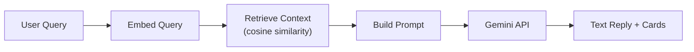
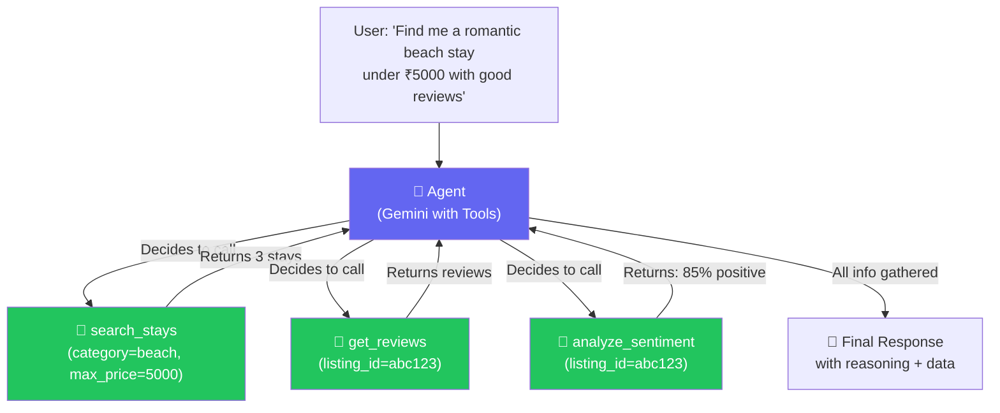
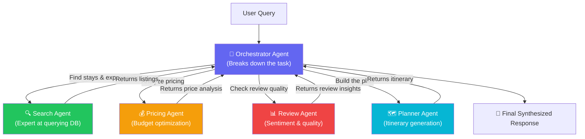

# 🤖 AI Agent Architecture vs Multi-Agent System — WanderLust

## What You Have Now (Simple RAG)



**Problem:** This is a **fixed pipeline**. The code decides what to retrieve, not the AI. The AI just generates text from whatever context you give it. It can't decide to "search differently" or "check reviews first."

---

## Option 1: AI Agent with Tool Calling

### The Core Idea

Instead of a fixed pipeline, the **AI itself decides what to do**. You give Gemini a set of **tools** (functions it can call), and it:

1. Reads the user's query
2. **DECIDES** which tool(s) to call
3. You execute the tool and return results
4. Gemini **REASONS** about the results
5. Maybe calls **MORE tools** based on what it learned
6. Synthesizes the final answer

This is called a **ReAct loop** (Reason → Act → Observe → Repeat).

### Architecture



### Tools You'd Define

| Tool | Parameters | What It Does |
|------|-----------|--------------|
| `search_stays` | location, min_price, max_price, category | Queries MongoDB for matching stays |
| `search_experiences` | location, type, difficulty, max_price | Queries MongoDB for experiences |
| `search_destinations` | country, keyword | Finds matching destinations |
| `get_listing_details` | listing_id | Gets full details of a specific stay |
| `get_reviews` | listing_id | Gets all reviews for a listing |
| `analyze_reviews` | listing_id | Runs sentiment analysis on reviews |
| `compare_listings` | listing_id_1, listing_id_2 | Side-by-side price/rating comparison |
| `plan_itinerary` | destination, days, budget, interests | Generates day-by-day plan |
| `get_similar` | listing_id | Finds similar stays using embeddings |

### Example Conversation

```
User: "I want to go to Malibu for a weekend. Show me beach stays 
       and experiences, and tell me which has better reviews."

🤖 Agent thinks: I need to:
   1. Search stays in Malibu
   2. Search experiences in Malibu  
   3. Get reviews for the best options
   4. Compare them

Step 1: Calls search_stays(location="Malibu", category="beach")
   → Gets: Cozy Beachfront Cottage (₹1,50,000/night), Beach Villa (₹80,000/night)

Step 2: Calls search_experiences(location="Malibu") 
   → Gets: Beachfront Sunset Yoga (₹1,500), Surf Lessons (₹3,000)

Step 3: Calls get_reviews("cottage_id") + get_reviews("villa_id")
   → Cottage: 4.5/5 (12 reviews), Villa: 3.8/5 (5 reviews)

Step 4: Synthesizes final answer:
   "For your Malibu weekend, I'd recommend the Cozy Beachfront Cottage — 
   it has a 4.5/5 rating from 12 reviews, significantly better than the 
   Beach Villa (3.8/5). Pair it with Beachfront Sunset Yoga for ₹1,500..."
```

### How Gemini Function Calling Works (Code)

```javascript
const model = genAI.getGenerativeModel({
    model: 'gemini-2.0-flash',
    tools: [{
        functionDeclarations: [
            {
                name: 'search_stays',
                description: 'Search for accommodation stays with filters',
                parameters: {
                    type: 'OBJECT',
                    properties: {
                        location: { type: 'STRING', description: 'City or country' },
                        max_price: { type: 'NUMBER', description: 'Maximum price per night' },
                        category: { type: 'STRING', description: 'e.g., beach, mountain, city' },
                    }
                }
            },
            {
                name: 'get_reviews',
                description: 'Get all reviews for a listing',
                parameters: {
                    type: 'OBJECT',
                    properties: {
                        listing_id: { type: 'STRING', description: 'The listing ID' }
                    },
                    required: ['listing_id']
                }
            },
            // ... more tools
        ]
    }]
});

// The AGENT LOOP
async function runAgent(userQuery) {
    const chat = model.startChat();
    let response = await chat.sendMessage(userQuery);
    
    // Keep looping while the agent wants to call tools
    while (response.response.candidates[0].content.parts.some(p => p.functionCall)) {
        const functionCalls = response.response.candidates[0].content.parts
            .filter(p => p.functionCall);
        
        const results = [];
        for (const call of functionCalls) {
            // Execute the tool
            const result = await executeFunction(call.functionCall.name, call.functionCall.args);
            results.push({ functionResponse: { name: call.functionCall.name, response: result } });
        }
        
        // Send results back to the agent
        response = await chat.sendMessage(results);
    }
    
    // Agent is done — return final text
    return response.response.text();
}
```

### Why This Is Impressive in Interviews

> **Interviewer:** "Tell me about your AI implementation."
> 
> **You:** "I built an autonomous AI agent using Gemini's function calling API. Instead of a fixed RAG pipeline, my agent has access to 8 tools — database queries, review analysis, price comparison — and it autonomously decides which tools to call based on the user's query. It uses a ReAct reasoning loop where it reasons about results before deciding the next action. For example, if a user asks for 'the best-reviewed beach stay under ₹5000,' the agent first searches by price and location, then fetches reviews for each result, runs sentiment analysis, and synthesizes a recommendation with full reasoning."

---

## Option 2: Multi-Agent System

### The Core Idea

Instead of ONE agent with many tools, you have **multiple specialized agents**, each an expert in one domain. An **Orchestrator** breaks down complex queries and delegates to specialists.

### Architecture



### How Each Agent Works

Each agent has its own **system prompt** and **specialized tools**:

| Agent | Specialty | Its Tools | System Prompt Focus |
|-------|----------|-----------|-------------------|
| **Orchestrator** | Task decomposition | Calls other agents | "Break complex travel queries into sub-tasks and delegate to specialists" |
| **Search Agent** | Finding listings | DB queries, semantic search, filters | "You are an expert at finding the right stays and experiences" |
| **Pricing Agent** | Price analysis | Price comparison, budget calculation | "You analyze prices, find deals, and optimize budgets" |
| **Review Agent** | Quality assessment | Review fetching, sentiment analysis | "You assess listing quality from reviews" |
| **Planner Agent** | Itinerary building | Uses results from other agents | "You create structured day-by-day travel plans" |

### Example Flow

```
User: "Plan a 3-day trip to Dubai. Budget ₹50,000 total. 
       I want adventure experiences and a well-reviewed hotel."

🧠 Orchestrator breaks this into:
   ├── Task 1 → Search Agent: "Find stays in Dubai"
   ├── Task 2 → Search Agent: "Find adventure experiences in Dubai"  
   ├── Task 3 → Pricing Agent: "Which combination fits ₹50,000 for 3 days?"
   ├── Task 4 → Review Agent: "Which stays have the best reviews?"
   └── Task 5 → Planner Agent: "Build 3-day itinerary with results"

🔍 Search Agent returns:
   Stays: Desert Resort (₹12,000/night), City Hotel (₹8,000/night)
   Experiences: Desert Safari (₹7,500), Dune Bashing (₹5,000)

💰 Pricing Agent calculates:
   "City Hotel (3 nights = ₹24,000) + Safari (₹7,500) + Dune (₹5,000) 
    = ₹36,500 — within budget! ₹13,500 remaining for food & transport."

📊 Review Agent reports:
   "City Hotel: 4.2/5 (mostly positive, guests love location)
    Desert Resort: 4.8/5 (excellent, but over budget)"

🗺️ Planner Agent generates:
   Day 1: Check into City Hotel → Evening desert safari
   Day 2: Morning dune bashing → Afternoon explore Dubai
   Day 3: Free morning → Check out
   Total: ₹36,500 (₹13,500 remaining)

🧠 Orchestrator synthesizes everything into the final response.
```

### Why This Is Impressive in Interviews

> **Interviewer:** "How does your AI system work?"
> 
> **You:** "I designed a multi-agent system with 4 specialized agents — each with its own system prompt and tools — coordinated by an orchestrator agent. The orchestrator uses task decomposition to break complex travel queries into sub-tasks and delegates them to the right specialist. For example, a pricing agent handles budget optimization while a review agent handles quality assessment. They work in parallel where possible, and the orchestrator synthesizes their outputs. This mirrors how production AI systems at companies like Google and OpenAI are being built today."

---

## Comparison: Which Should You Build?

| Aspect | Single Agent + Tools | Multi-Agent System |
|--------|---------------------|-------------------|
| **Complexity** | Medium | High |
| **Interview Impact** | 🔥🔥🔥🔥 | 🔥🔥🔥🔥🔥 |
| **API Calls** | 3-6 per query | 5-10 per query (more quota usage) |
| **Build Time** | ~2-3 hours | ~4-5 hours |
| **Reliability** | More stable | More complex error handling |
| **Buzzword Value** | "AI Agent", "Tool Calling", "ReAct" | "Multi-Agent", "Orchestration", "Distributed AI" |

## 💡 My Recommendation

**Build Option 1 (Single Agent with Tools) first**, then **evolve it into Option 2 (Multi-Agent)**. 

Why? The single agent is the foundation — you build the tools and the agent loop. Then you split the single agent into multiple specialized agents with an orchestrator on top. This gives you:
- A working feature faster
- A clear narrative: "I started with a single agent, then evolved it into a multi-agent system as complexity grew"
- Both talking points for interviews

> [!IMPORTANT]
> Both options use the same Gemini API you already have — the difference is in **how you architect the code**, not what API you call. That's what makes it impressive — it shows **system design** thinking, not just API knowledge.
